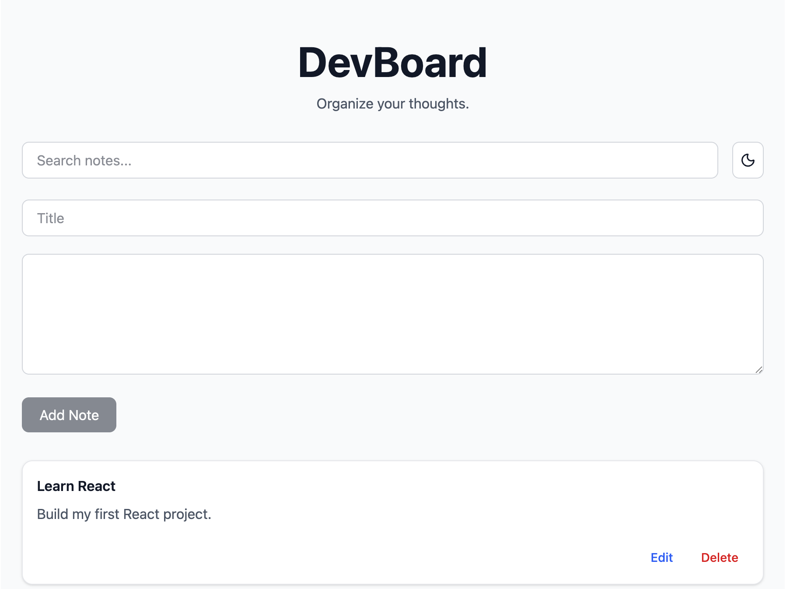
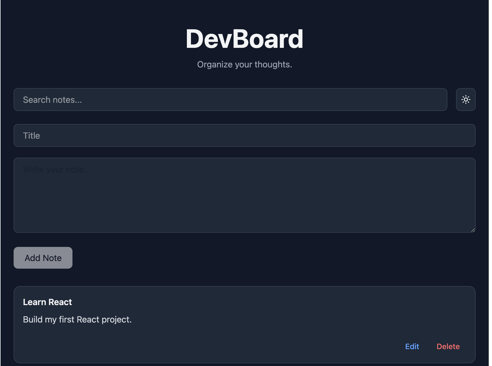

# DevBoard

A clean, responsive note-taking application built with React and Tailwind CSS.

DevBoard allows users to create, edit, search, and manage notes with a modern, distraction-free interface. Notes and theme preferences are automatically saved in the browser, providing a seamless experience across sessions.

## Live Demo

https://devboard-umber.vercel.app/

## Features

- ✨ Create notes
- 📝 Edit existing notes
- 🗑️ Delete notes
- 🔍 Search notes instantly
- 🌙 Light & Dark mode
- 💾 Persistent storage using Local Storage
- 📱 Fully responsive design
- ⚡ Fast development experience powered by Vite

## Tech Stack

- React
- JavaScript (ES6+)
- Tailwind CSS
- Vite
- Lucide React

## Installation

Clone the repository:

```bash
git clone <your-github-repository-url>
```

Navigate to the project:

```bash
cd devboard
```

Install dependencies:

```bash
npm install
```

Start the development server:

```bash
npm run dev
```

Open:

```
http://localhost:5173
```

## Production Build

Build the application:

```bash
npm run build
```

Preview the production build locally:

```bash
npm run preview
```

## Project Structure

```
src/
├── components/
│   ├── AddNoteForm/
│   ├── Header/
│   ├── NoteCard/
│   ├── NotesList/
│   ├── SearchBar/
│   └── ThemeToggle/
│
├── hooks/
│   ├── useDarkMode.js
│   └── useLocalStorage.js
│
├── App.jsx
├── index.css
└── main.jsx
```

## Screenshots

### Light Mode



### Dark Mode



## Future Improvements

Potential enhancements include:

- Rich text formatting
- Categories or tags
- Drag-and-drop note organization
- Note pinning
- Export and import notes
- Cloud synchronization
- Keyboard shortcuts

## License

This project is licensed under the MIT License.
